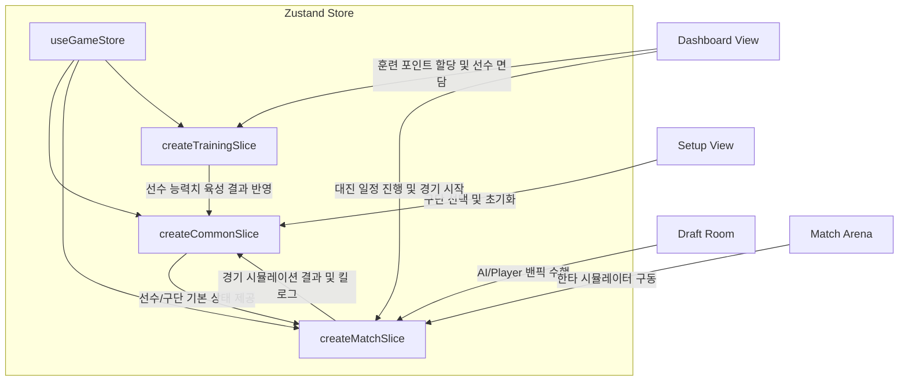

# 🎮 LoL Manager 2026 (롤 매니저 2026)

<div align="center">


**2026년 서머 스플릿 글로벌 로스터와 130+개 챔피언이 연계된 프리미엄 E-Sports 시뮬레이션 웹 애플리케이션**

</div>

---

## 📖 프로젝트 개요 (Overview)

**LoL Manager 2026**은 리그 오브 레전드 프로 구단의 감독이 되어 선수단 구성, 이적 시장 영입, 전술 수립 및 실시간 경기 시뮬레이션을 통해 LCK 및 월드 챔피언십 우승을 겨루는 **React/TypeScript 기반의 하이엔드 구단 관리 시뮬레이터**입니다. 

단순한 수치 경쟁을 넘어, 실제 2026년 6월 현재 활동 중인 국내외 오피셜 로스터와 130개 이상의 챔피언 카운터/시너지 상성 공식을 도입하여 극대화된 전략성과 운영의 묘미를 제공합니다.

---

## 🌟 핵심 게임 시스템 (Core Systems)

### 1. 🧬 스마트 밴픽 드래프트 AI (Draft AI)
구단 감독으로서 가장 중요하게 설계된 전술적 분기점입니다.
*   **카운터/시너지 가중치**: 모든 챔피언은 카운터 ID(`counterIds`)와 시너지 ID(`synergyIds`) 관계가 정밀 설계되어 있습니다. 밴픽 창에서 상대편의 카운터 챔피언을 선택하면 디버프가 주어지며, 아군 간의 조합(예: 야스오-그라가스 돌진 조합, 아지르-마오카이 한타 조합) 시너지가 완성되면 전체 한타력 가중치가 부여됩니다.
*   **챔피언 숙련도 연동**: 각 선수의 고유 챔피언 숙련도(`championPool`) 수치(1~10)가 픽에 연계됩니다. 선수의 숙련도가 높은 시그니처 픽(예: Faker의 아지르/오리아나)을 쥐여주면 기본 피지컬 능력치에 추가 가산점을 획득합니다.

### 2. 🏟️ 한타 연산식 기반 매치 시뮬레이션 Engine
*   **선수 오버롤(Stat) 융합**: 라인전 페이즈(`lanePhase`), 메카닉(`mechanics`), 오더(`macro`), 한타력(`teamfight`) 등 다차원 스탯 반영.
*   **컨디션 & 폼 시스템**: 매 경기 선수들의 에너지 소모율, 사기(Morale), 그리고 컨디션 변동 기복(`consistency`)이 실시간 반영되어 기복에 따른 능력치 버프/너프가 연산됩니다.
*   **실시간 전투 로그**: 소환사의 협곡에서 펼쳐지는 퍼스트 블러드, 오브젝트(용/바론) 사냥, 한타 대승 등의 게임 내 하이라이트 로그가 킬 스코어와 함께 실시간 중계되며 플레이어는 이를 3배속 조절 및 즉시 완료로 제어할 수 있습니다.

### 3. 💼 구단 재정 및 글로벌 이적 시장
*   **2026 서머 라인업 완벽 반영**: LCK 10개 팀 리브랜딩 정보(DN SOOPers, HANJIN BRION, Kiwoom DRX)와 해외 주요 구단(BLG, JDG, G2 등)의 오피셜 로스터 수록.
*   **이적 및 주급 관리**: 제한된 구단 예산 내에서 이적 보상액을 저울질하고, 이적 시장(Transfer Market)을 이용해 주전 및 벤치 자원을 영입하거나 방출할 수 있습니다.
*   **FA 시장과 메일 시스템**: 타 구단에서 소속 선수에게 들어오는 충격적인 이적 오퍼 메일을 수락/거부하거나, FA 시장에 등장한 TheShy, Peanut, BeryL 등의 슈퍼스타들을 자유롭게 영입할 수 있습니다.

### 4. 📈 선수단 훈련 및 스태프 멘탈 코칭
*   **훈련 포인트 시스템**: 매주 제공되는 훈련 포인트를 소모해 선수의 취약점을 보강하거나 시그니처 능력치를 강화합니다.
*   **스태프 영입**: 감독(Head Coach), 전술 코치, 멘탈 코치 등 스태프진을 영입하여 매주 훈련 효율과 선수들의 면담 사기 보정 효과를 상승시킵니다.
*   **개별 면담 시스템**: 폼이 떨어진 선수에게 '따뜻한 격려' 또는 '따끔한 비판', '주전 보장' 등의 대화 키워드를 통해 사기(Morale)를 높여 폼 향상을 꾀합니다.

---

## 📂 프로젝트 폴더 구조 (Directory Structure)

```bash
lol-manager/
├── src/
│   ├── components/            # 재사용 가능한 UI 컴포넌트군
│   │   ├── dashboard/         # 오피스 홈, 로스터, 스케줄, 순위표 탭 컴포넌트
│   │   ├── draft/             # 밴픽 드래프트 룸 및 선택 인터페이스
│   │   ├── match/             # 실시간 경기 중계 및 시뮬레이션 로그 뷰
│   │   └── ui/                # 아바타, 버튼 등 원자 컴포넌트 (Shadcn UI 기반)
│   ├── data/
│   │   └── initialData.ts     # 130+ 챔피언 및 LCK 구단/로스터/FA 원천 데이터베이스
│   ├── store/                 # Zustand 전역 상태 저장소
│   │   ├── slices/
│   │   │   ├── commonSlice.ts   # 날짜, 이적, 메일, 면담 등 공통 상태 슬라이스
│   │   │   ├── matchSlice.ts    # 밴픽, 대진 일정, 경기 시뮬레이션 전용 슬라이스
│   │   │   └── trainingSlice.ts # 선수단 훈련 포인트 및 능력치 개편 슬라이스
│   │   ├── storeUtils.ts      # 글로벌 구단 로스터, 대진표 생성 알고리즘 등
│   │   └── useGameStore.ts    # 통합 게임 스토어 훅 (Zustand)
│   ├── types/
│   │   └── index.ts           # 선수, 팀, 매치, 코칭스태프 관련 전체 인터페이스 정의
│   ├── utils/
│   │   ├── draft.ts           # 밴픽 드래프트 연산 보조 함수
│   │   ├── format.ts          # 연봉 및 예산 포맷 유틸
│   │   └── simulator.ts       # 인게임 킬로그 및 한타 확률 연산 시뮬레이터 엔진
│   ├── views/
│   │   ├── Dashboard.tsx      # 구단 오피스 및 메인 게임 루프 메인 대시보드
│   │   └── Setup.tsx          # 게임 시작 시 감독 정보 등록 및 구단 선택 화면
│   ├── App.tsx                # 라우팅 및 뷰 진입 지점
│   ├── main.tsx
│   └── index.css              # Glassmorphism 등 프리미엄 CSS 테마 스타일링
├── index.html
├── vite.config.ts             # TailwindCSS 플러그인이 탑재된 Vite 설정
├── netlify.toml               # Netlify SPA 배포용 리다이렉트 구성
├── package.json
└── tsconfig.json
```

---

## 🎨 상태 관리 아키텍처 (State Management Architecture)

이 프로젝트는 단일 전역 저장소인 **Zustand**를 통해 거대한 구단 시뮬레이션 데이터를 유기적으로 제어합니다. 상태 파편화를 막기 위해 상태 영역을 **Slices** 패턴으로 결합하여 구조화하였습니다.



*   **createCommonSlice**: 날짜 흐름, 메일 수신/확인, 이적 제의 처리, 코칭스태프 영입 및 해고, 선수단과의 면담 대화 등 구단 일상 운영을 제어합니다.
*   **createMatchSlice**: 시즌 일정 더블 라운드 로빈 스케줄 생성, 밴픽 화면 전환, AI 드래프트 의사 결정, 인게임 킬 로그 및 실시간 한타 시뮬레이션의 경기 진행 상태를 제어합니다.
*   **createTrainingSlice**: 매주 갱신되는 훈련 점수를 소모하여 선수들의 능력치(라인전, 메카닉, 운영 등)를 직접 조율하는 훈련 세션을 제어합니다.

---

## 🚀 로컬 개발 환경 구동 방법 (Local Quick Start)

### Prerequisites
*   Node.js (LTS 버전 권장, 18.x 이상)

### Steps
1.  **원천 소스코드 복제 및 경로 이동**:
    ```bash
    git clone https://github.com/YOUR_GITHUB_ID/lol-manager.git
    cd lol-manager
    ```
2.  **의존성 패키지 설치**:
    ```bash
    npm install
    ```
3.  **로컬 개발 서버 실행**:
    ```bash
    npm run dev
    ```
    *   개발 서버가 가동되면 웹 브라우저에서 `http://localhost:3000`으로 접속하여 게임을 진행합니다.

---

## 🌐 Netlify 클라우드 배포 스펙 (Netlify Deployment)

본 저장소는 클라우드 호스팅 서비스인 **Netlify** 배포용 설정(`netlify.toml`)을 루트에 제공하고 있어, GitHub 연동 시 원클릭 빌드 및 무중단 배포를 지원합니다.

### netlify.toml 설정 구성
*   **빌드 설정**: 빌드 명령어로 `npm run build`를 수행하고, 배포 디렉토리로 `dist`를 탐색합니다.
*   **SPA 라우팅 보호**: `/*` 경로로 들어오는 새로고침 및 직접 주소 입력 요청을 `index.html`로 상태 코드 200과 함께 정상 라우팅하여 React App의 라우트 이탈 에러(404 Not Found)를 완벽히 해결합니다.
